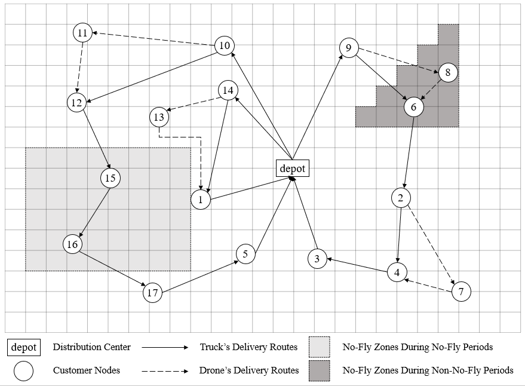

# VRPD-with-No-Fly-Zones
Solving the Vehicle Routing Problem with Drones (VRP-D) under no-fly zone constraints using a hybrid Tabu Search-Simulated Annealing (TS-SA) algorithm.

## Quick Start

See [`VRPD-with-No-Fly-Zones.ipynb`](VRPD-with-No-Fly-Zones.ipynb). It requires loading instance files from the [`Sets/`](Sets/), and the solution results will be written into Excel files (as shown in [`Solutions/`](Solutions/))

## Model Design

### Model Paradigm

- Multi-truck multi-drone collaborative system
- One distribution center; all vehicles depart from and return to the center
- One drone per truck
- A drone serves only one customer per sortie
- A drone can only be recovered by the truck that launched it

### Decision Variables

| Variable | Description |
|----------|-------------|
| $x_{ij}^k$ | =1 if truck $k$ travels directly from node $i$ to node $j$; 0 otherwise |
| $x_{iwj}^{u_k}$ | =1 if drone $u_k$ leaves truck $k$ at node $i$, serves customer $w$, and returns to truck $k$ at node $j$; 0 otherwise |
| $y_{ij}^k$ | =1 if node $i$ is visited before node $j$ by truck $k$; 0 otherwise |
| $z_{ih}^{u_k}$ | =1 if drone $u_k$ arrives at or departs from node $i$ during the active period of no-fly zone $h$; 0 otherwise |
| $z_{ijh}^{u_k}$ | =1 if drone $u_k$ traverses from node $i$ to node $j$ through the active no-fly zone $h$; 0 otherwise |

### Objective Function

Minimize total system cost, including truck travel cost, drone flight cost, truck fixed cost, drone fixed cost, truck waiting cost, and drone waiting cost.

### Constraints

- Truck and drone maximum travel distance
- Truck and drone load capacity
- Flow balance constraints
- Temporal synchronization constraints

## No-Fly Zone Design

- **Dynamic** – time-varying activation windows
- **Irregular** – arbitrary convex or concave polygons

## Algorithm Design

### Two-Stage Solution Framework

#### Outer Layer: Truck Route Optimization

- Generate initial feasible truck routes using sequential insertion method
- Six neighborhood operators: Insert, Swap, 2-opt, Relocate, Exchange, and Cross
- Adaptive operator selection based on historical performance
- Tabu search with tabu list to avoid cycling
- Metropolis criterion to accept inferior solutions with a certain probability
- Multiple termination criteria to balance solution quality and computational efficiency

#### Inner Layer: Drone Task Assignment

- Given a truck route, formulate drone assignment as a shortest path problem on a weighted directed graph
- Solve optimally using Dijkstra's algorithm
- No-fly zone conflict detection using ray casting and orientation methods
- A* algorithm for detour path planning around dynamic irregular no-fly zones

## Node Sets

### Data Structure

| Column | Description |
|--------|-------------|
| x | X-coordinate |
| y | Y-coordinate |
| ID | Node identifier |
| Demand | Customer demand |

- Row 0: Distribution center (demand = 0)
- Rows 1–N: Customer nodes with positive demand

### Instance Sizes

| Set | Nodes |
|-----|-------|
| Set1 | 10 |
| Set2 | 25 |
| Set3 | 100 |
| Set4 | 250 |

## Updated Version

An updated version (see [`VRPD-with-No-Fly-Zones_Updated.ipynb`](VRPD-with-No-Fly-Zones_Updated.ipynb)) has been introduced, which enhances the TS-SA framework by integrating ALNS-style large neighborhood search operators. 
- Extending the original 6 small-scale neighborhood operators with 4 destroy operators and 2 repair operators
- Improving solution stability on large-scale and complex instances
- Using the same [`Sets/`](Sets/) instances
- Adding a plotting utility to visualize the optimization progress over iterations

## Experimental Results (Updated Version)

### vs Gurobi

- Set1: 100% optimal · 86.3% faster
- Set2: 0.82% gap · 174× faster

### vs ALNS

- Set3: 6.3% lower cost · 62.4% faster
- Set4: 14.8% lower cost · 86.5% faster · more stable

Parameters Setting (via orthogonal design): max iterations = 2000, tabu length = 15, no-improvement threshold = 200, initial temperature = 2000, cooling rate = 0.98, weight update period = 20, learning rate = 0.3, weight bounds = [0.1, 3.0]. Candidate size: 3 for Set1–2, 10 for Set3, 20 for Set4.
